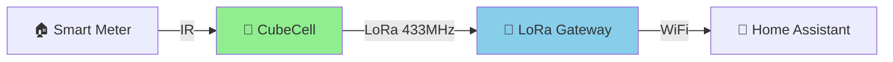

# 🔌 Volkszähler LoRa Smart Meter Bridge

<div align="center">


**Long-range, battery-powered smart meter monitoring for Home Assistant**

[Features](#-features) • [Hardware](#-hardware) • [Quick Start](#-quick-start) • [Documentation](#-documentation) • [Gallery](#-gallery)

</div>

---

## 🎯 Overview

Transform your smart meter into a wireless IoT sensor! This project creates a **battery-efficient LoRa bridge** between Volkszähler IR readers and Home Assistant, enabling remote monitoring of energy consumption without cables or WiFi at the meter location.



## ✨ Features

### 🔋 Ultra-Low Power
- **3+ months** on a single 2000mAh battery
- Deep sleep with **3.5µA** consumption
- Configurable transmission intervals

### 📡 Long Range Communication
- **2km+ urban** / **10km+ rural** range
- 433 MHz ISM band (license-free)
- Robust LoRa modulation with error correction

### 🏠 Smart Home Ready
- **Native ESPHome integration**
- Auto-discovery in Home Assistant
- Real-time OLED display
- Energy dashboard compatible

### 📊 Comprehensive Monitoring
- ⚡ Live power consumption/generation
- 📈 Total energy import/export
- 🔋 Battery level monitoring
- 📶 Signal strength (RSSI/SNR)
- 📦 Packet loss tracking

## 🛠 Hardware

### Required Components

| Component | Model | Price | Link |
|-----------|-------|-------|------|
| **Transmitter** | Heltec CubeCell HTCC-AB01 | ~$15 | [🛒](https://heltec.org/project/htcc-ab01/) |
| **IR Reader** | Volkszähler IR Head | ~$25 | [🛒](https://wiki.volkszaehler.org/hardware/controllers/ir-schreib-lesekopf) |
| **Gateway** | LilyGo T3 LoRa32 v1.6.1 | ~$30 | [🛒](https://www.lilygo.cc/products/lora3) |
| **Battery** | 18650 Li-Ion (optional) | ~$10 | Local |
| **Case** | Waterproof enclosure | ~$15 | Local |

**Total Cost: ~$95**

### 📐 Wiring Diagram

<details>
<summary><b>CubeCell ← → IR Reader Connections</b></summary>

```
┌──────────────┐         ┌─────────────┐
│   CubeCell   │         │  IR Reader  │
│              │         │             │
│         GPIO4├─────────┤TX           │
│         GPIO5├─────────┤RX           │
│           GND├─────────┤GND          │
│           3V3├─────────┤VCC          │
│              │         │             │
│    [LoRa]    │         │   [IR LED]  │
└──────────────┘         └─────────────┘
```

</details>

## 🚀 Quick Start

### 1️⃣ Flash CubeCell Transmitter

```bash
# Clone repository
git clone https://github.com/barde/cubeCellVolkszaehler.git
cd volkszahlerCubeCell

# Install PlatformIO
pip install platformio

# Build and upload firmware
pio run -e cubecell_testmode --target upload

# Monitor output (optional)
pio device monitor
```

### 2️⃣ Setup LoRa Gateway

```bash
# Navigate to gateway directory
cd lilygo_gateway

# Configure WiFi credentials
cp secrets.yaml.example secrets.yaml
nano secrets.yaml  # Add your WiFi SSID and password

# Install ESPHome
pip install esphome

# Flash gateway
esphome run lilygo_lora_receiver.yaml
```

### 3️⃣ Home Assistant Integration

1. Go to **Settings** → **Devices & Services**
2. ESPHome integration auto-discovers the gateway
3. Click **Configure** to add
4. Add sensors to Energy Dashboard

## 📖 Documentation

### Configuration Files

#### 🔧 LoRa Parameters (`src/lora_data.h`)
```cpp
#define LORA_FREQUENCY      433000000  // 433 MHz EU
#define LORA_SPREADING_FACTOR 7        // SF7 for speed
#define LORA_BANDWIDTH      0           // 125 kHz
#define LORA_TX_POWER       14          // 14 dBm
```

#### ⚙️ Build Modes (`platformio.ini`)

| Mode | Description | Battery Life |
|------|-------------|--------------|
| `cubecell_testmode` | 5-second intervals, test data | 1 week |
| `cubecell_lora` | 60-second intervals, production | 3 months |
| `cubecell_debug` | USB powered, verbose logging | N/A |

### 📊 Data Protocol

```cpp
typedef struct {
  float power_watts;           // -10000 to 10000 W
  float total_consumption_kwh; // 0 to 999999 kWh
  float total_generation_kwh;  // 0 to 999999 kWh  
  float battery_voltage;       // 2.0 to 4.2 V
  uint32_t packet_counter;     // Sequence number
} MeterData;  // 20 bytes total
```

## 🔍 Supported Smart Meters

Compatible with **SML protocol** meters:

✅ Logarex LK13BE (tested)  
✅ EMH ED300L  
✅ Iskra MT681  
✅ Easymeter Q3D  
✅ Most German smart meters  

## 🐛 Troubleshooting

<details>
<summary><b>Common Issues & Solutions</b></summary>

| Problem | Solution |
|---------|----------|
| **No LoRa reception** | Check antennas connected, verify 433 MHz on both devices |
| **Poor range** | Use external antenna, increase TX power, reduce SF |
| **Battery drains fast** | Increase send interval, check deep sleep working |
| **Wrong energy values** | Verify OBIS codes match your meter model |
| **Display not working** | Check I2C connections (SDA=21, SCL=22) |

</details>

## 📈 Performance

| Metric | Value |
|--------|-------|
| **Range (Urban)** | 2-3 km |
| **Range (Rural)** | 8-12 km |
| **Battery Life** | 3+ months (2000mAh) |
| **Packet Size** | 20 bytes |
| **TX Current** | 48 mA |
| **Sleep Current** | 3.5 µA |
| **Gateway Power** | 100 mA @ 5V |

## 🤝 Contributing

Contributions are welcome! Please feel free to submit a Pull Request.

1. Fork the repository
2. Create your feature branch (`git checkout -b feature/AmazingFeature`)
3. Commit your changes (`git commit -m 'Add some AmazingFeature'`)
4. Push to the branch (`git push origin feature/AmazingFeature`)
5. Open a Pull Request

## 📝 License

This project is licensed under the MIT License - see the [LICENSE](LICENSE) file for details.

## 🙏 Acknowledgments

- [Volkszähler](https://volkszaehler.org/) - IR reader protocol
- [Heltec](https://heltec.org/) - CubeCell platform
- [ESPHome](https://esphome.io/) - ESP32 framework
- [Home Assistant](https://home-assistant.io/) - Smart home platform

## 📬 Contact

**Barde** - [@barde](https://github.com/barde)

Project Link: [https://github.com/barde/cubeCellVolkszaehler](https://github.com/barde/cubeCellVolkszaehler)

---

<div align="center">

**⭐ Star this repo if you find it useful!**

Made with ❤️ for the Home Automation Community

</div>